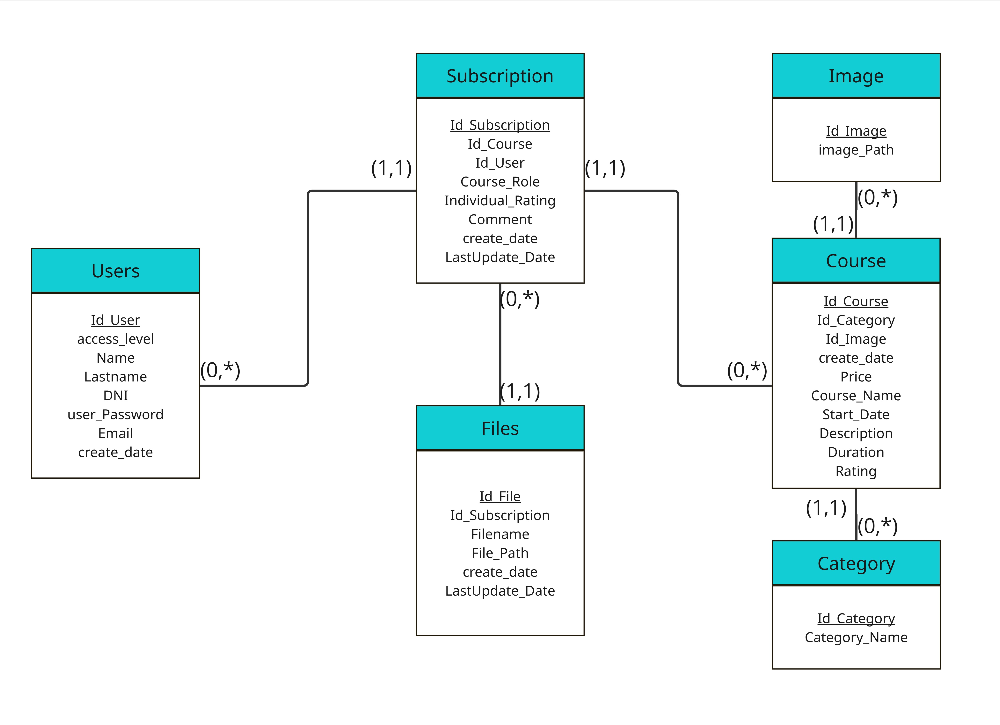
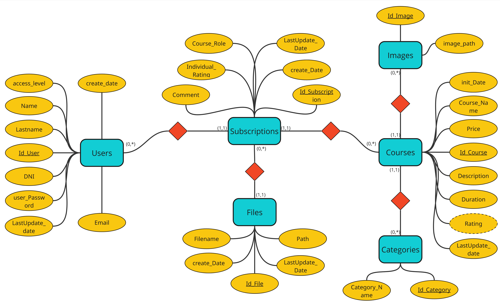

# 🎓 Course Management Page

This project involved creating an online course management system (LMS), developed across three main areas: database, backend, and frontend.

---

## 🗄️ Database

The database structure was designed and documented to support all LMS functionalities. Inside the `database/diagrams` folder, there are two essential diagrams:

### 📘 Class Diagram  
The object-oriented structure of the system was modeled, detailing classes, attributes, methods, and relationships:

### 🧩 Entity-Relationship Design  
The entity-relationship design was created, defining entities, attributes, and relationships needed for proper data organization:

---

## 🔧 Backend

The backend was implemented in **Golang** to provide all necessary interfaces and services for the LMS:

- A user authentication and authorization system was configured, managing two types of users: *student* and *administrator*.
- Endpoints were developed to manage courses, including creation, editing, and deletion by administrators.
- An endpoint was created to list the courses a user was enrolled in.
- Security mechanisms such as JWT token-based authorization and secure password hashing were implemented.

---

## 💻 Frontend

The frontend was developed using **ReactJS**, serving as the final user interface and consuming backend services:

- The home screen was designed to display a list of courses available for enrollment.
- A search engine was implemented to filter courses by keywords or categories.
- Detailed information for each course was shown, including description, instructor, duration, and prerequisites.
- Enrollment buttons were enabled for users to register for courses of interest.
- A "My Courses" section was developed to allow users to view and access the courses they were enrolled in.

---

## 🧰 Tools Used

- ⚙️ Golang (backend)  
- ⚛️ ReactJS (frontend)  
- 🐬 MySQL (database)  
- 🐳 Docker (containerization)  
- 🔐 JWT (authentication and security)  
